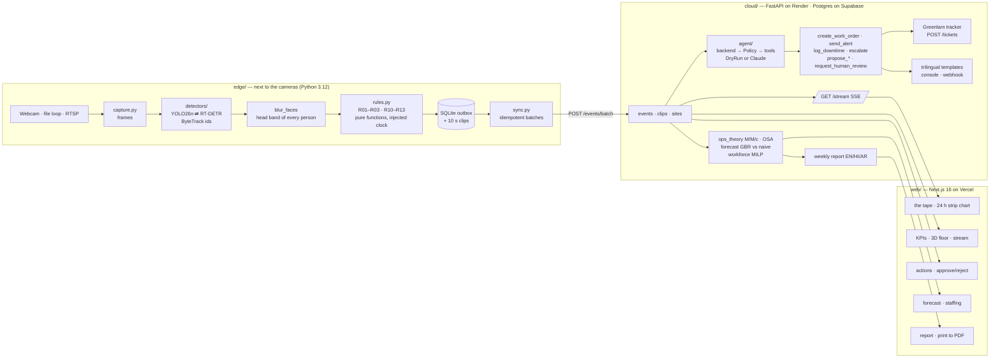

# Architecture

RAQIB / MUSHRIF is one pipeline with two site profiles. Deterministic rules on the edge turn detections into Events; a bounded agent in the cloud decides what to do about them; a control-room web app shows both.

## Data flow in one sentence

A frame is captured, persons are tracked, heads are blurred, rules compare tracks to zones with the frame's timestamp, any Event is written to SQLite and (when online) posted to the API, which stores it, streams it to open dashboards, and runs the agent: the backend proposes tool calls, the Policy filters them, autonomous calls execute and are logged, proposals wait for a human on `/actions`.

## Boundaries

| Unit | Depends on | Exposes |
|---|---|---|
| `edge/raqib_edge/events.py` | nothing | `Event`, `Det`, `Track` |
| `edge/raqib_edge/rules.py` | events, zones | `evaluate(tracks, site, camera, state, now, …) -> list[Event]` |
| `edge/raqib_edge/detectors/` | ultralytics | `Detector` protocol, `make_detector(name)` |
| `edge/raqib_edge/pipeline.py` | all edge modules | `run_pipeline(...) -> Stats` |
| `cloud/raqib_api/agent/policies.py` | tools, models | `Policy.check(event, calls, confidence) -> PolicyOutcome` |
| `cloud/raqib_api/agent/backends.py` | anthropic (optional) | `DryRunBackend`, `ClaudeBackend`, `make_backend()` |
| `cloud/raqib_api/ops_theory.py` | nothing | `mmc`, `slot_rates`, `service_level`, `tills_for_target_rho` |
| `cloud/raqib_api/workforce.py` | scipy, ops_theory | `staffing_plan(lam, mu, …) -> StaffingPlan` |
| `cloud/raqib_api/forecast.py` | sklearn, pandas | `fit_predict(series, horizon) -> ForecastResult` |
| `web/lib/api.ts` | fetch | typed client for every endpoint |
| `web/components/tape/` | api, store | the tape |

## Why this shape

- **Rules before models.** Safety decisions must be auditable, cheap, and fast. A person inside an exclusion zone is geometry, not judgement. The LLM adds judgement about *what to do*, and only through allow-listed tools.
- **Events are the contract.** The edge and the cloud share one `Event` shape; the web app renders it. Adding a rule adds an event kind, nothing else.
- **Offline first.** SQLite is the source of truth on the edge; the cloud is a replica plus reasoning. Wi-Fi loss costs nothing but latency.
- **Profiles, not forks.** Retail and factory differ in site YAML (zones, thresholds, machines), which rules run, and the signal colour. Everything else is shared.

## Deployment

| Piece | Where | Config |
|---|---|---|
| Edge | M4 Pro (MPS) or any Linux box / Jetson; Docker for CPU | `edge/sites/*.yaml`, `.env` |
| API | Render web service (free tier sleeps; edge buffers) | `render.yaml` |
| Database | Supabase Postgres | `cloud/supabase/schema.sql` |
| Web | Vercel | `web/vercel.json`, `NEXT_PUBLIC_API_URL` |
