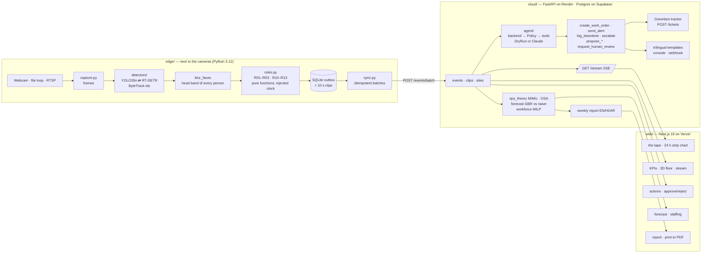

# Architecture

RAQIB / MUSHRIF is one pipeline with two site profiles. Deterministic rules on the edge turn detections into Events; a bounded agent in the cloud decides what to do about them; a control-room web app shows both.



## v2: the agentic layer (Phases E–K)

v2 adds nothing between the camera and the Event. It adds six capabilities on top of the same Event and the same `Policy`, all behind one zero-cost model provider chain and one role model.

```mermaid
flowchart TB
  subgraph EDGE2["edge/ (v2 additions)"]
    MJ[stream.py<br/>MJPEG of blurred frames<br/>detections poster] --> CAM2[/cameras/]
    PL[planogram.py · ocr.py<br/>R14 price mismatch · R15 planogram drift] --> EV2[/events/batch/]
    TEL[telemetry.py<br/>heartbeat/min · 2-min drift samples<br/>weights hash] --> FLEET
  end
  subgraph PROVIDER["llm/ — one adapter, zero paid inference"]
    PC[ProviderChain<br/>Ollama → Gemini free → Groq free<br/>quota counters · strict JSON · one span per call]
  end
  subgraph CLOUD2["cloud/ (v2)"]
    EV2 --> DISPATCH[crew.dispatch<br/>kill switch? → Phase B handle_event]
    DISPATCH --> CREW[crew/runtime<br/>FloorOps · ShelfOps · Workforce · Safety · Analyst · Auditor<br/>allow-list → Policy → ToolRunner<br/>budgets · HMAC bus · evidence required]
    CREW --> MEM[(memories<br/>provenance · quarantine · snapshots)]
    CAM2 --> VLM[vlm/opinion<br/>blurred frames ≤ N per event<br/>advisory · never lowers severity]
    EV2 --> RAG[rag/ indexer → chunks + pgvector<br/>router (deterministic EN/HI/AR) → hybrid retrieval → cited answer]
    RAG --> ASK[/POST /ask · SSE stages/]
    EV2 --> TWIN[twin/ replay 1-min bins · what-if M/M/c + MILP]
    POS[integrations/pos · whatsapp · greenlam<br/>circuit breaker · idempotency] --> EV2
    FLEET[fleet/ drift PSI · health · stores] --> EV2
    SEC[security/ ASI01–ASI10 red-team harness<br/>routers/security · policy editor · retention job]
    AUTH[auth/ Supabase JWT · viewer<operator<manager<admin · site scoping · rate limits]
    PC -.-> CREW & VLM & RAG
  end
  subgraph WEB2["web/ (v2 tabs)"]
    ASK --> T1[Ask]
    VLM --> T2[Watch]
    CREW --> T3[Crew]
    TWIN --> T4[Twin]
    POS --> T5[Settings · Shelves]
    FLEET --> T6[Fleet]
    SEC --> T7[Security]
  end
```

| v2 unit | Depends on | Exposes |
|---|---|---|
| `cloud/raqib_api/llm/provider.py` | ollama, google-genai, groq (all optional) | `ProviderChain.complete/try_complete`, `get_provider(task)` |
| `cloud/raqib_api/rag/` | llm, models, pgvector or SQLite JSON | `index_site`, `route`, `retrieve`, `answer` |
| `cloud/raqib_api/vlm/opinion.py` | llm, events | `second_opinion(event, frames) -> Opinion` (advisory) |
| `cloud/raqib_api/crew/` | agent.tools, agent.policies | `dispatch(event, session)`, `Runtime.run(agent, trigger, ctx)`, `Bus`, `remember/recall/rollback` |
| `cloud/raqib_api/twin/` | ops_theory, workforce | `replay(site, date)`, `whatif(site, date, sliders)` |
| `cloud/raqib_api/integrations/` | httpx | `pos.import_csv`, `whatsapp.send_template`, `greenlam.Client` |
| `cloud/raqib_api/auth/` | pyjwt, Supabase | `current_principal`, `require(capability)` |
| `cloud/raqib_api/fleet/` | models | `drift.psi_report`, `health.boxes`, `stores.leaderboard` |
| `cloud/security/` | the API in-process | `run.py --gate` → `docs/results/security_eval.json` |
| `edge/raqib_edge/integrity.py` | hashlib | `verify_weights(path)` refuses to start on a pinned-hash mismatch |

## Data flow in one sentence

A frame is captured, persons are tracked, heads are blurred, rules compare tracks to zones with the frame's timestamp, any Event is written to SQLite and (when online) posted to the API, which stores it, streams it to open dashboards, and runs the agent: the backend proposes tool calls, the Policy filters them, autonomous calls execute and are logged, proposals wait for a human on `/actions`.

## Boundaries

| Unit | Depends on | Exposes |
|---|---|---|
| `edge/raqib_edge/events.py` | nothing | `Event`, `Det`, `Track` |
| `edge/raqib_edge/rules.py` | events, zones | `evaluate(tracks, site, camera, state, now, …) -> list[Event]` |
| `edge/raqib_edge/detectors/` | ultralytics | `Detector` protocol, `make_detector(name)` |
| `edge/raqib_edge/pipeline.py` | all edge modules | `run_pipeline(...) -> Stats` |
| `cloud/raqib_api/agent/policies.py` | tools, models | `Policy.check(event, calls, confidence) -> PolicyOutcome` |
| `cloud/raqib_api/agent/backends.py` | anthropic (optional) | `DryRunBackend`, `ClaudeBackend`, `make_backend()` |
| `cloud/raqib_api/ops_theory.py` | nothing | `mmc`, `slot_rates`, `service_level`, `tills_for_target_rho` |
| `cloud/raqib_api/workforce.py` | scipy, ops_theory | `staffing_plan(lam, mu, …) -> StaffingPlan` |
| `cloud/raqib_api/forecast.py` | sklearn, pandas | `fit_predict(series, horizon) -> ForecastResult` |
| `web/lib/api.ts` | fetch | typed client for every endpoint |
| `web/components/tape/` | api, store | the tape |

## Why this shape

- **Rules before models.** Safety decisions must be auditable, cheap, and fast. A person inside an exclusion zone is geometry, not judgement. The LLM adds judgement about *what to do*, and only through allow-listed tools.
- **Events are the contract.** The edge and the cloud share one `Event` shape; the web app renders it. Adding a rule adds an event kind, nothing else.
- **Offline first.** SQLite is the source of truth on the edge; the cloud is a replica plus reasoning. Wi-Fi loss costs nothing but latency.
- **Profiles, not forks.** Retail and factory differ in site YAML (zones, thresholds, machines), which rules run, and the signal colour. Everything else is shared.

## Deployment

| Piece | Where | Config |
|---|---|---|
| Edge | M4 Pro (MPS) or any Linux box / Jetson; Docker for CPU | `edge/sites/*.yaml`, `.env` |
| API | Render web service (free tier sleeps; edge buffers) | `render.yaml` |
| Database | Supabase Postgres | `cloud/supabase/schema.sql` |
| Web | Vercel | `web/vercel.json`, `NEXT_PUBLIC_API_URL`, CSP in `next.config.ts` |
| Models | Ollama on the site box or laptop; Gemini free and Groq free as fallbacks; Anthropic present but off | `LLM_PROVIDER`, `LLM_PROVIDER_ORDER`, `EMBED_MODEL` (`docs/models.md`) |
| Auth | Supabase Auth (magic link, Google) | `SUPABASE_JWT_SECRET` or `SUPABASE_JWKS_URL`, `AUTH_REQUIRED` |
| Security gate | GitHub Actions `security.yml` | red-team harness, pip-audit, npm audit, gitleaks |
